# OpenPorts 🔍⚡

**Lightning-fast port scanner and process manager for developers**

Stop wondering what's running on your ports. OpenPorts gives you instant visibility into your system's network activity with beautiful, actionable insights.

## ✨ Features
- 🚀 **Blazing Fast**: Optimized algorithms for instant port discovery
- 🎯 **Smart Filtering**: Find exactly what you're looking for
- 💀 **Process Control**: Kill processes with confidence
- 🎨 **Beautiful Output**: Rich terminal UI (when available)
- 🔧 **Developer Friendly**: Perfect for debugging and development
- 🌍 **Cross Platform**: Works on Windows, macOS, and Linux

## Quick Start
```bash
pip install openports
openports              # List all listening ports
openports -p 3000      # Check specific port
openports -s react     # Find React processes
openports -a           # Include non-listening connections
openports -k 3000      # Kill processes on port 3000
openports -k 3000 -y   # Kill without the confirmation prompt
```

## Output formats
```bash
openports --json       # Machine-readable JSON (pipe-clean stdout)
openports --csv        # CSV output
openports -v           # Show full command lines in the table
```

`--json` and `--csv` write only data to stdout; status messages go to stderr, so
they pipe cleanly into other tools (e.g. `openports --json | jq '.[].port'`).

Perfect for developers, DevOps engineers, and anyone who needs to understand their system's network activity.


